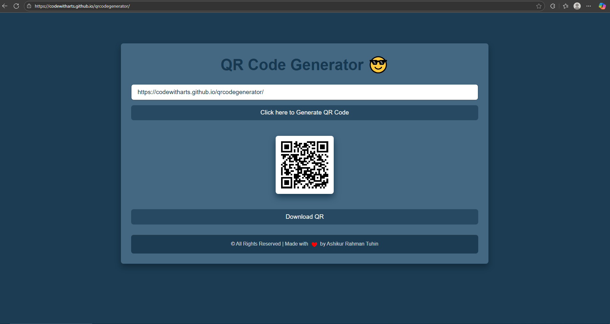

# QR Code Generator 🧾🔳

A simple and responsive QR Code Generator built using **HTML**, **CSS**, and
**Vanilla JavaScript**.  
It allows users to enter any text or URL and generate a QR code instantly, with
an option to **download** it as a PNG image.

## 🚀 Features

- ✅ Live QR Code generation
- ✅ PNG download functionality
- ✅ Fully responsive design for mobile, tablet, and desktop
- ✅ Smooth animations and hover effects
- ✅ Built without any frameworks or libraries

## 📸 Demo Preview

 <!-- Add a screenshot if available -->

## 🛠️ Technologies Used

- HTML5
- CSS3 (Responsive + Custom Styles)
- JavaScript (Vanilla)
- [QR Code API](https://goqr.me/api/)

## 🔧 How to Use

1. Clone or download the repository.
2. Open `index.html` in your browser.
3. Type your text or URL into the input field.
4. Click the **"Generate QR Code"** button.
5. The QR code will appear below.
6. Click the **"Download"** button to save it as a `.png` file.

## 🌐 Live Link

[View Live Demo](https://codewitharts.github.io/qrcodegenerator/)
